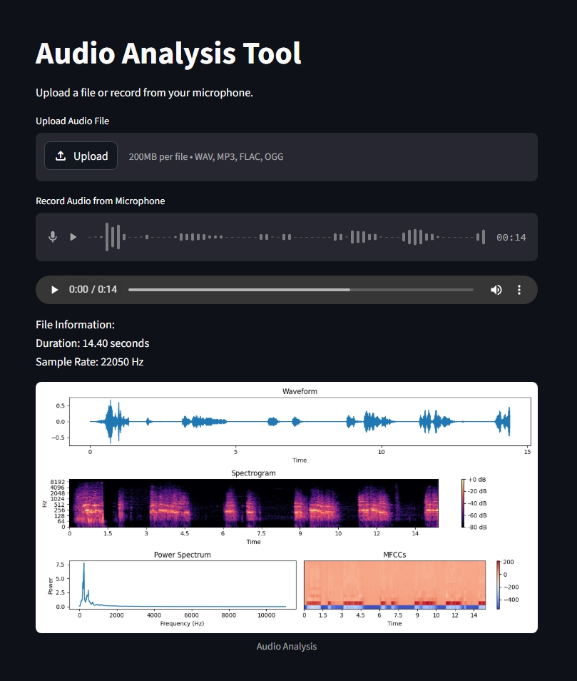

# 🎶 Waves2Data

  Waves2Data is a lightweight audio analysis web application built using Streamlit. It allows users to upload or record audio directly from the browser and generate meaningful visual and statistical insights from the signal.

The application focuses on transforming raw audio into interpretable data using standard digital signal processing techniques. It is designed for ease of use while still providing useful analytical outputs for learning, research, and experimentation.


## Features

* Upload audio files in WAV, MP3, FLAC, or OGG formats
* Record audio directly from the browser using a microphone
* Automatic audio conversion to WAV format when required
* Time-domain visualization (waveform)
* Frequency-domain analysis (spectrogram and power spectrum)
* Feature extraction using Mel-frequency cepstral coefficients (MFCCs)
* Simple and interactive web interface powered by Streamlit

## Demo

### Live Application

Access the deployed app here:
[Waves2Data](https://waves2data.streamlit.app/)

### Screenshot



## How It Works

Waves2Data processes audio in the following stages:

1. Input acquisition

   * Accepts uploaded audio files or microphone recordings

2. Preprocessing

   * Converts non-WAV files into WAV format
   * Loads audio using librosa

3. Feature extraction and analysis

   * Computes waveform representation
   * Generates spectrogram using Short-Time Fourier Transform (STFT)
   * Calculates power spectrum
   * Extracts MFCC features

4. Visualization

   * Displays all results as plots for easy interpretation


## Installation

Clone the repository:

```bash
git clone https://github.com/Adhhiiiiiiii/Waves2Data.git
cd Waves2Data
```

Install dependencies:

```bash
pip install -r requirements.txt
```

Run the application:

```bash
streamlit run app.py
```


## Usage

Run the application using Streamlit:

```bash
streamlit run app.py
```

Then open the provided local URL in your browser.


## Requirements

* Python 3.9 or later
* streamlit
* librosa
* numpy
* matplotlib
* soundfile
* scipy


## Project Structure

```
waves2data/
│
├── assets/
│    └── waves2data.jpeg  # ScreenShot
├── app.py                # Main application file
├── requirements.txt      # Dependencies
└── README.md             # Documentation
```


## Use Cases

* Audio signal analysis and visualization
* Educational demonstrations of DSP concepts
* Speech and sound pattern exploration
* Preprocessing step for machine learning pipelines


## Limitations

* Not designed for real-time streaming analysis
* Performance depends on input file size
* Limited to basic feature extraction (no advanced ML models)


## License

This project is free to use by anyone. No license restrictions are applied. Users are free to use, modify, and distribute the software without limitation.


## Contribution

Contributions are welcome. You can improve the project by:

* Adding new audio features
* Enhancing visualization
* Improving performance
* Extending functionality with machine learning models


## Acknowledgements

This project utilizes open-source libraries including librosa, NumPy, Matplotlib, and Streamlit.
